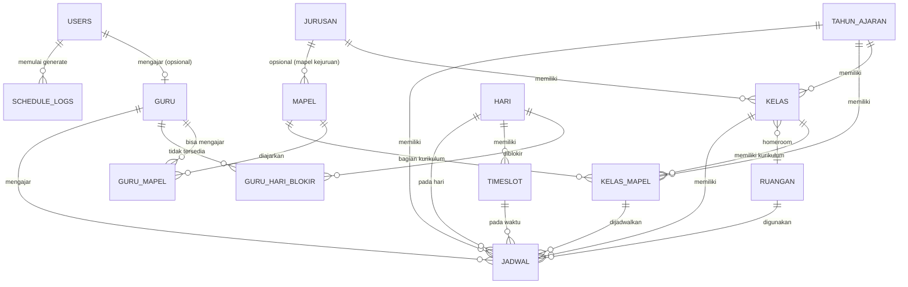
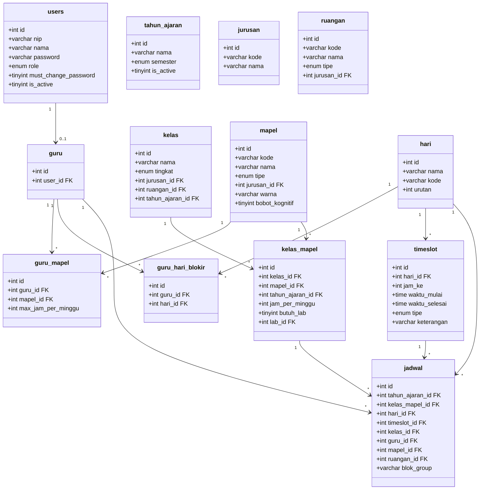
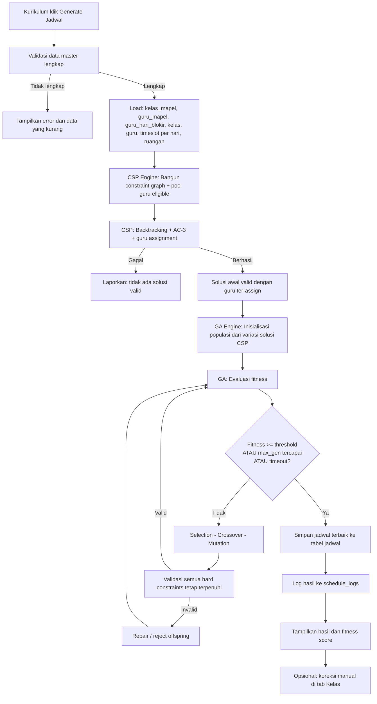
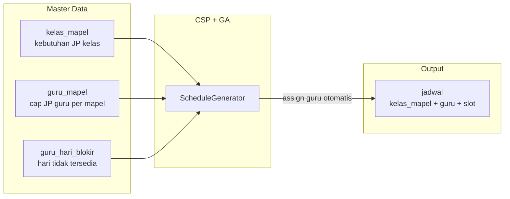

# PRD — Smart School Scheduling (S3)

**Versi**: 3.2  
**Tanggal**: 5 Juli 2026  
**Last Updated**: 15 Juli 2026 — Guru self-service `guru_hari_blokir`, approval Kepsek setelah publish, SC-12 lab day packing, pengaturan nama/logo sekolah (`app_settings`)  
**Tech Stack**: PHP 8.2+, CodeIgniter 4.7, MySQL/MariaDB  
**Algoritma**: Constraint Satisfaction Problem (CSP) + Genetic Algorithm (GA)

---

## 1. Ringkasan Produk

**Smart School Scheduling (S3)** adalah aplikasi dashboard berbasis web untuk Sekolah Menengah Kejuruan (SMK) yang mampu men-generate jadwal mata pelajaran secara otomatis menggunakan kombinasi algoritma CSP dan GA. Aplikasi ini memastikan:

- Tidak ada jadwal yang **bentrok** (guru, ruangan, kelas)
- **Jam kosong (gap) diminimalkan** lewat soft constraint (SC-1 guru, SC-2 siswa) — bukan lagi aturan mutlak, sehingga algoritma selalu bisa menyelesaikan jadwal satu minggu penuh
- Mata pelajaran **khusus jurusan** hanya diberikan kepada kelas jurusan yang sesuai
- **Lab** tidak digunakan bersamaan oleh lebih dari satu kelas pada waktu yang sama
- Setiap kelas **tetap di ruang homeroom-nya** untuk semua mata pelajaran umum — **hanya pindah ke lab** saat mata pelajaran kejuruan yang membutuhkan lab
- Tidak ada penggabungan kelas (co-teaching), setiap kelas berdiri sendiri
- **Kebutuhan JP per kelas** didefinisikan di master kelas (`kelas_mapel`); **penugasan guru** dilakukan **sepenuhnya otomatis** oleh algoritma saat generate
- **Timeslot per hari bersifat dinamis** — Senin/Rabu berbeda dari Selasa/Kamis, Jumat lebih pendek
- **Laporan jam mengajar guru** tersedia untuk Kepala Sekolah sebagai dasar perhitungan gaji manual

### Peran Pengguna

| Role | Deskripsi Singkat |
|------|-------------------|
| **Kurikulum** | Manajemen semua data master, generate jadwal, reset password user. Bisa juga mengajar jika memiliki profil guru. |
| **Guru** | Melihat jadwal mengajar sendiri, total JP/minggu hasil generate, export PDF/Excel. |
| **Kepala Sekolah** | Melihat semua jadwal sekolah, laporan jam mengajar per guru. |

> **Catatan v2.0**: Role **Murid dihapus** — aplikasi tidak lagi menyediakan login atau tampilan untuk siswa.

---

## 2. Konteks Sekolah

### 2.1 Waktu Operasional — Profil Per Hari

Jam pelajaran **tidak seragam** setiap hari. Referensi visual: [`docs/jam_sekolah.jpeg`](jam_sekolah.jpeg) — *DURASI PEMBELAJARAN SMK TUNAS TEKNOLOGI, Tahun Pelajaran 2025–2026*.

| Hari | JP Mulai | Total JP | Istirahat | Pulang | Catatan |
|------|----------|----------|-----------|--------|---------|
| Senin | 07:25 | 10 | 2× (10:10, 12:30) | 15:00 | 06:45–07:25 = **Upacara** (bukan JP) |
| Selasa | 06:45 | 11 | 2× (09:55, 12:15) | 14:45 | — |
| Rabu | 07:25 | 10 | 2× (10:10, 12:30) | 15:00 | 06:45–07:25 = **Pembiasaan Baik** (bukan JP) |
| Kamis | 06:45 | 11 | 2× (09:55, 12:15) | 14:45 | — |
| Jumat | 06:45 | **6** | 1× (09:25) | **10:55** | Hari lebih pendek |

**Kapasitas mingguan per kelas**: 10 + 11 + 10 + 11 + 6 = **48 JP/minggu**

> Durasi per JP **bervariasi** (30–50 menit) antar slot — bukan flat 45 menit. Timeslot dikonfigurasi Kurikulum via CRUD **per hari**.

### 2.2 Struktur Jam Pelajaran Per Hari

#### Senin (10 JP + Upacara)

| Jam Ke | Waktu | Tipe | Durasi |
|--------|-------|------|--------|
| — | 06:45 – 07:25 | Kegiatan Khusus | Upacara |
| 1 | 07:25 – 08:15 | JP | 50 menit |
| 2 | 08:15 – 08:50 | JP | 35 menit |
| 3 | 08:50 – 09:25 | JP | 35 menit |
| 4 | 09:25 – 10:10 | JP | 45 menit |
| — | 10:10 – 10:30 | Istirahat | 20 menit |
| 5 | 10:30 – 11:10 | JP | 40 menit |
| 6 | 11:10 – 11:50 | JP | 40 menit |
| 7 | 11:50 – 12:30 | JP | 40 menit |
| — | 12:30 – 13:00 | Istirahat | 30 menit |
| 8 | 13:00 – 13:40 | JP | 40 menit |
| 9 | 13:40 – 14:20 | JP | 40 menit |
| 10 | 14:20 – 15:00 | JP | 40 menit |

#### Selasa & Kamis (11 JP)

| Jam Ke | Waktu | Tipe | Durasi |
|--------|-------|------|--------|
| 1 | 06:45 – 07:25 | JP | 40 menit |
| 2 | 07:25 – 08:05 | JP | 40 menit |
| 3 | 08:05 – 08:45 | JP | 40 menit |
| 4 | 08:45 – 09:25 | JP | 40 menit |
| 5 | 09:25 – 09:55 | JP | 30 menit |
| — | 09:55 – 10:15 | Istirahat | 20 menit |
| 6 | 10:15 – 10:55 | JP | 40 menit |
| 7 | 10:55 – 11:35 | JP | 40 menit |
| 8 | 11:35 – 12:15 | JP | 40 menit |
| — | 12:15 – 12:45 | Istirahat | 30 menit |
| 9 | 12:45 – 13:15 | JP | 30 menit |
| 10 | 13:15 – 13:55 | JP | 40 menit |
| 11 | 13:55 – 14:45 | JP | 50 menit |

#### Rabu (10 JP + Pembiasaan Baik)

Struktur JP identik dengan Senin (jam ke-1 mulai 07:25, 10 JP, 2 istirahat). Perbedaan: slot 06:45–07:25 = **Pembiasaan Baik** (bukan Upacara).

#### Jumat (6 JP)

| Jam Ke | Waktu | Tipe | Durasi |
|--------|-------|------|--------|
| 1 | 06:45 – 07:15 | JP | 30 menit |
| 2 | 07:15 – 08:00 | JP | 45 menit |
| 3 | 08:00 – 08:40 | JP | 40 menit |
| 4 | 08:40 – 09:25 | JP | 45 menit |
| — | 09:25 – 09:40 | Istirahat | 15 menit |
| 5 | 09:40 – 10:10 | JP | 30 menit |
| 6 | 10:10 – 10:55 | JP | 45 menit |

### 2.3 Jurusan & Mata Pelajaran

| Kode | Nama Jurusan |
|------|-------------|
| TKJ | Teknik Komputer dan Jaringan |
| TKR | Teknik Kendaraan Ringan |
| AP | Administrasi Perkantoran |
| AK | Akuntansi |

**Mata Pelajaran Umum** (berlaku semua jurusan — diajarkan di **homeroom**):
Matematika, Bahasa Indonesia, Bahasa Inggris, Pendidikan Agama, PKN, Sejarah, Seni Budaya, PJOK, Fisika, Kimia, dll.

**Mata Pelajaran Kejuruan** (khusus per jurusan — **bisa** di homeroom atau lab):
- TKJ: Komputer & Jaringan Dasar, Pemrograman Dasar, Sistem Komputer, Administrasi Infrastruktur Jaringan, dll.
- TKR: Teknologi Dasar Otomotif, Pemeliharaan Mesin Kendaraan Ringan, Pemeliharaan Sasis & Pemindah Tenaga, dll.
- AP: Teknologi Perkantoran, Korespondensi, Kearsipan, Administrasi Keuangan, dll.
- AK: Akuntansi Dasar, Perbankan Dasar, Akuntansi Keuangan, Komputer Akuntansi, dll.

> **Penting**: Tidak ada penggabungan kelas. Setiap kelas berdiri sendiri dan mendapat jadwal masing-masing.

### 2.4 Struktur Kelas

Setiap jurusan memiliki **minimal 4 kelas** per tingkat (bisa lebih, dinamis sesuai data yang diinput Kurikulum).

| Tingkat | TKJ | TKR | AP | AK | Total |
|---------|-----|-----|----|----|-------|
| X | 4 | 4 | 4 | 4 | 16 |
| XI | 4 | 4 | 4 | 4 | 16 |
| XII | 4 | 4 | 4 | 4 | 16 |
| **Total** | **12** | **12** | **12** | **12** | **48** |

> Jumlah kelas bersifat **dinamis** — Kurikulum bisa menambah/mengurangi sesuai kebutuhan sekolah. Angka 4 di atas adalah **minimum seed data** untuk pengujian.

**Kurikulum per kelas** (`kelas_mapel`): Setiap kelas memiliki daftar mata pelajaran beserta **JP per minggu** yang wajib terpenuhi. Contoh kelas X TKJ 1: MTK 4 JP, B. Indo 3 JP, KJD 4 JP, dll. — **tanpa guru** di level ini.

### 2.5 Aturan Ruangan Kelas

> **ATURAN KRITIS**: Setiap kelas memiliki **homeroom (ruangan tetap)** yang TIDAK PERNAH berubah.

- **Mata pelajaran umum** → Diajarkan di **homeroom** kelas masing-masing
- **Mata pelajaran kejuruan yang TIDAK butuh lab** → Diajarkan di **homeroom** kelas masing-masing
- **Mata pelajaran kejuruan yang BUTUH lab** → Kelas **pindah ke lab jurusan**; `kelas_mapel.lab_id` = **lab utama (preferensi)**; solver boleh memakai lab jurusan lain jika utama penuh; **satu hari satu lab** per kelas_mapel
- **Yang di-generate hanya mata pelajarannya** — ruangan kelas tidak berubah kecuali ada perpindahan ke lab
- Satu lab tidak boleh digunakan oleh 2 kelas bersamaan pada hari & jam yang sama

### 2.6 Model Beban Mengajar v2.0

| Entitas | Apa yang Didefinisikan | Contoh |
|---------|------------------------|--------|
| **`kelas_mapel`** | Kebutuhan JP/minggu per mapel di kelas tertentu | X TKJ 1 → MTK 4 JP/minggu |
| **`guru_mapel`** | Mapel yang bisa diajar guru + **cap maksimal JP/minggu** per mapel | Guru A → MTK max 12 JP, Fisika max 8 JP |
| **Algoritma (generate)** | Penugasan guru ke slot jadwal | Guru A mengisi MTK di X TKJ 1, X TKJ 2, ... |

**Aturan penugasan guru:**
- Satu guru bisa mengajar **beberapa mata pelajaran** (mis. MTK + Fisika)
- Guru **bebas mengajar di tingkatan kelas manapun** untuk mapel umum
- Guru mapel **kejuruan** hanya boleh di-assign ke kelas dengan **jurusan yang sama** (guru TKJ tidak mengajar mapel/kelas TKR)
- Jika guru MTK 1 sudah mencapai cap JP-nya, sisa kebutuhan MTK diambil guru MTK 2 atau dibagi ke guru MTK 3
- Total JP mingguan guru = Σ `max_jam_per_minggu` dari semua `guru_mapel`-nya
- Guru bisa **diblokir per hari** via `guru_hari_blokir` — contoh: Guru A tidak mengajar hari Rabu (HC-4)

---

## 3. User Roles & Permissions

### 3.1 Role Matrix

| Fitur | Kurikulum | Guru | Kepala Sekolah |
|-------|:---------:|:----:|:--------------:|
| Login (Email + Password) | ✅ | ✅ | ✅ |
| Dashboard ringkasan | ✅ | ✅ | ✅ |
| CRUD Data Master (jurusan, ruangan, kelas, guru, mapel, timeslot, tahun ajaran) | ✅ | — | — |
| CRUD Kurikulum Kelas (`kelas_mapel`) | ✅ | — | — |
| CRUD Kemampuan Guru (`guru_mapel`) | ✅ | — | — |
| Generate Jadwal (CSP + GA) | ✅ | — | — |
| Koreksi Manual Jadwal (tambah/hapus/swap per slot, tab Kelas) | ✅ | — | — |
| Parameter Generator | ✅ | — | — |
| Reset Password User Lain | ✅ | — | — |
| Lihat Jadwal Per Kelas | ✅ | — | ✅ |
| Lihat Jadwal Per Guru | ✅ | — | ✅ |
| Lihat Jadwal Per Ruangan | ✅ | — | ✅ |
| Lihat Jadwal Mengajar Sendiri | ✅* | ✅ | — |
| Atur Preferensi Jadwal (SC-7) | — | ✅ | — |
| Export Jadwal Sendiri (PDF/Excel) | ✅* | ✅ | — |
| Laporan Jam Mengajar Guru (gaji) | — | — | ✅ |
| Export Laporan Gaji (PDF/Excel) | — | — | ✅ |
| Edit Profil & Ganti Password Sendiri | ✅ | ✅ | ✅ |

*\*Hanya jika user memiliki record di tabel `guru` (mengajar aktif)*

### 3.2 Mekanisme Login

- **Semua role** login menggunakan **email** + `password` dari tabel `users` (kolom `nip` opsional, bukan kredensial login)
- Autentikasi menggunakan **session-based** CI4 native (tanpa library eksternal)
- Password di-hash menggunakan `password_hash()` (bcrypt)

**Alur Login:**
1. User input **email** + password
2. Sistem cek di tabel `users` (cocokkan `email`, `is_active = 1`)
3. Verifikasi `is_active = 1` dan password dengan `password_verify()`
4. Jika `must_change_password = 1` → redirect ke halaman ganti password (wajib sebelum akses fitur lain)
5. Cek apakah user punya profil `guru` (FK `user_id`) → set `guru_id` di session (nullable)
6. Set session: `user_id`, `role` (`guru` / `kurikulum` / `kepala_sekolah`), `nama`, `guru_id` (nullable)
7. Redirect ke dashboard sesuai role

**Kurikulum dual-role:** Jika `role = kurikulum` DAN ada record `guru` → akses gabungan: master data + generate jadwal + jadwal mengajar sendiri.

### 3.3 Manajemen Password

| Fitur | Detail |
|-------|--------|
| Ganti Password Sendiri | Semua user bisa ubah password via halaman Profil |
| Reset Password (Kurikulum) | Reset password user ke default (`password123` atau nilai configurable) |
| Paksa Ganti Password | Set `must_change_password = 1` setelah reset; user wajib ganti saat login berikutnya |

---

## 4. Arsitektur Sistem

### 4.1 High-Level Architecture

```
┌──────────────────────────────────────────────────────────┐
│                    Browser (Client)                       │
│   ┌─────────────┐  ┌──────────┐  ┌───────────────────┐   │
│   │ Kurikulum   │  │   Guru   │  │  Kepala Sekolah   │   │
│   │ Dashboard   │  │Dashboard │  │    Dashboard      │   │
│   └──────┬──────┘  └────┬─────┘  └────────┬──────────┘   │
└──────────┼──────────────┼───────────────────┼─────────────┘
           │              │                   │
           ▼              ▼                   ▼
┌──────────────────────────────────────────────────────────┐
│              CodeIgniter 4 Application                    │
│  ┌────────────┐  ┌────────────┐  ┌───────────────────┐   │
│  │ Controllers│  │   Models   │  │      Views        │   │
│  │            │  │            │  │   (Native PHP)    │   │
│  │ - Auth     │  │ - UserModel│  │                   │   │
│  │ - Profile  │  │ - GuruModel│  │                   │   │
│  │ - Kurikulum│  │ - Kelas    │  │                   │   │
│  │ - Guru     │  │ - Jadwal   │  │                   │   │
│  │ - Kepala   │  │ - Mapel    │  │                   │   │
│  │   Sekolah  │  │            │  │                   │   │
│  └─────┬──────┘  └─────┬──────┘  └───────────────────┘   │
│        │               │                                  │
│  ┌─────▼───────────────▼────────────────────────────┐   │
│  │              Libraries / Services                   │   │
│  │  ┌──────────────────────────────────────────────┐   │   │
│  │  │         ScheduleGenerator Service            │   │   │
│  │  │  ┌─────────────┐  ┌───────────────────┐     │   │   │
│  │  │  │  CSP Engine │  │    GA Engine      │     │   │   │
│  │  │  │  (Initial   │  │   (Optimize +     │     │   │   │
│  │  │  │   Solution  │  │  Guru Assignment) │     │   │   │
│  │  │  │  + Guru     │  │                   │     │   │   │
│  │  │  │  Assignment)│  │                   │     │   │   │
│  │  │  └─────────────┘  └───────────────────┘     │   │   │
│  │  └──────────────────────────────────────────────┘   │   │
│  └─────────────────────────────────────────────────────┘   │
└──────────────────────────┬───────────────────────────────┘
                           ▼
                  ┌─────────────────┐
                  │  MySQL/MariaDB  │
                  └─────────────────┘
```

### 4.2 Struktur Folder Aplikasi

```
app/
├── Config/
│   └── Routes.php
├── Controllers/
│   ├── AuthController.php
│   ├── ProfileController.php
│   ├── DashboardController.php
│   ├── Kurikulum/
│   │   ├── UserController.php
│   │   ├── GuruController.php
│   │   ├── GuruMapelController.php
│   │   ├── GuruHariBlokirController.php
│   │   ├── JurusanController.php
│   │   ├── KelasController.php
│   │   ├── KelasMapelController.php
│   │   ├── MapelController.php
│   │   ├── RuanganController.php
│   │   ├── TimeslotController.php
│   │   ├── TahunAjaranController.php
│   │   └── ScheduleController.php
│   ├── Guru/
│   │   └── JadwalController.php
│   └── KepalaSekolah/
│       ├── JadwalController.php
│       └── LaporanController.php
├── Models/
│   ├── UserModel.php
│   ├── GuruModel.php
│   ├── GuruMapelModel.php
│   ├── GuruHariBlokirModel.php
│   ├── JurusanModel.php
│   ├── KelasModel.php
│   ├── KelasMapelModel.php
│   ├── MapelModel.php
│   ├── RuanganModel.php
│   ├── TimeslotModel.php
│   ├── TahunAjaranModel.php
│   └── JadwalModel.php
├── Libraries/
│   ├── ScheduleGenerator.php       ← Orchestrator
│   ├── CSPEngine.php               ← Constraint solver + guru assignment
│   ├── GAEngine.php                ← Genetic algorithm optimizer
│   ├── SchedulingContext.php       ← Shared scheduling helpers
│   ├── JadwalPlacementValidator.php ← HC validation (manual + swap)
│   ├── JadwalManualService.php     ← Manual place/delete/swap
│   ├── HistoryRepairEngine.php     ← Regenerate dari history publish
│   ├── ScheduleHistoryService.php  ← Publish & history log
│   ├── PdfExporter.php / ExcelExporter.php
│   └── LaporanGuruJamExporter.php
├── Filters/
│   ├── AuthFilter.php
│   ├── KurikulumFilter.php
│   ├── GuruFilter.php
│   └── KepalaSekolahFilter.php
├── Views/
│   ├── layouts/
│   │   └── main.php
│   ├── auth/
│   │   ├── login.php
│   │   └── change_password.php
│   ├── profile/
│   │   └── index.php
│   ├── dashboard/
│   │   ├── kurikulum.php
│   │   ├── guru.php
│   │   └── kepala_sekolah.php
│   ├── kurikulum/
│   │   ├── users/
│   │   ├── guru/
│   │   ├── jurusan/
│   │   ├── kelas/
│   │   ├── mapel/
│   │   ├── ruangan/
│   │   ├── timeslot/
│   │   ├── tahun_ajaran/
│   │   └── schedule/
│   ├── guru/
│   │   └── jadwal/
│   └── kepala_sekolah/
│       ├── jadwal/
│       └── laporan/
└── Database/
    ├── Migrations/
    └── Seeds/
```

---

## 5. Desain Database

### 5.1 Daftar Tabel (16 Tabel v3.2)

| # | Tabel | Keterangan |
|---|-------|------------|
| 1 | `users` | Autentikasi semua role |
| 2 | `guru` | Profil mengajar (opsional per user) |
| 3 | `guru_mapel` | Kemampuan & cap JP guru per mapel |
| 4 | `guru_hari_blokir` | Hari-hari guru tidak tersedia mengajar |
| 5 | `guru_preferensi` | Preferensi/hindari hari-slot guru (SC-7) |
| 6 | `tahun_ajaran` | Tahun ajaran & semester |
| 7 | `jurusan` | Data jurusan |
| 8 | `ruangan` | Ruangan & lab |
| 9 | `kelas` | Data kelas |
| 10 | `kelas_mapel` | Kurikulum per kelas (kebutuhan JP) |
| 11 | `mapel` | Katalog mata pelajaran |
| 12 | `timeslot` | Slot jam per hari |
| 13 | `hari` | Hari sekolah |
| 14 | `jadwal` | Hasil generate jadwal (per `schedule_log_id`) |
| 15 | `schedule_config` | Parameter generator |
| 16 | `schedule_logs` | Log proses generate & publish |

> **Dihapus dari v1.1**: `murid`, `pengajaran`

### 5.2 Entity Relationship Diagram (ERD)



### 5.3 Detail Tabel

---

#### 5.3.1 `users` — Autentikasi Semua Role

| Kolom | Tipe | Constraint | Keterangan |
|-------|------|-----------|------------|
| `id` | INT | PK, AUTO_INCREMENT | |
| `nip` | VARCHAR(30) | NULL | Nomor Induk Pegawai (opsional, bukan login) |
| `nama` | VARCHAR(100) | NOT NULL | |
| `email` | VARCHAR(100) | UNIQUE, NOT NULL | Kredensial login |
| `no_telp` | VARCHAR(20) | NULL | |
| `password` | VARCHAR(255) | NOT NULL | Bcrypt hash |
| `role` | ENUM('guru','kurikulum','kepala_sekolah') | NOT NULL | Role aplikasi |
| `must_change_password` | TINYINT(1) | DEFAULT 0 | 1 = wajib ganti password saat login |
| `is_active` | TINYINT(1) | DEFAULT 1 | 0 = akun nonaktif |
| `created_at` | DATETIME | | |
| `updated_at` | DATETIME | | |
| `deleted_at` | DATETIME | NULL | Soft delete |

---

#### 5.3.2 `guru` — Profil Mengajar (Opsional)

| Kolom | Tipe | Constraint | Keterangan |
|-------|------|-----------|------------|
| `id` | INT | PK, AUTO_INCREMENT | |
| `user_id` | INT | FK → users.id, UNIQUE, NOT NULL | Satu user max satu profil guru |
| `created_at` | DATETIME | | |
| `updated_at` | DATETIME | | |
| `deleted_at` | DATETIME | NULL | Soft delete |

> User dengan `role = kurikulum` atau `kepala_sekolah` **tidak wajib** punya record di tabel ini. Hanya user yang benar-benar mengajar (termasuk Kurikulum yang juga mengajar) yang memiliki profil guru.

---

#### 5.3.3 `guru_mapel` — Kemampuan & Kapasitas Guru per Mapel

| Kolom | Tipe | Constraint | Keterangan |
|-------|------|-----------|------------|
| `id` | INT | PK, AUTO_INCREMENT | |
| `guru_id` | INT | FK → guru.id, NOT NULL | |
| `mapel_id` | INT | FK → mapel.id, NOT NULL | |
| `max_jam_per_minggu` | INT | NOT NULL | Cap JP mingguan guru untuk mapel ini |
| `created_at` | DATETIME | | |
| `updated_at` | DATETIME | | |
| `deleted_at` | DATETIME | NULL | Soft delete |

**Unique Constraint**: (`guru_id`, `mapel_id`)

**Contoh**: Guru A → MTK max 12 JP, Fisika max 8 JP → total kapasitas mingguan = 20 JP.

**Aturan Bisnis**:
- Guru mapel **kejuruan** hanya boleh di-assign ke kelas dengan `jurusan_id` yang sama
- Guru mapel **umum** boleh mengajar semua jurusan dan tingkatan
- Algoritma tidak boleh assign guru melebihi `max_jam_per_minggu` per mapel (HC-6)

---

#### 5.3.4 `guru_hari_blokir` — Hari Guru Tidak Tersedia Mengajar

> Mendefinisikan hari-hari di mana guru **tidak boleh** dijadwalkan mengajar. Jika guru tidak punya record di tabel ini, diasumsikan **tersedia semua hari**.

| Kolom | Tipe | Constraint | Keterangan |
|-------|------|-----------|------------|
| `id` | INT | PK, AUTO_INCREMENT | |
| `guru_id` | INT | FK → guru.id, NOT NULL | |
| `hari_id` | INT | FK → hari.id, NOT NULL | Hari yang diblokir |
| `created_at` | DATETIME | | |
| `updated_at` | DATETIME | | |

**Unique Constraint**: (`guru_id`, `hari_id`)

**Contoh**: Guru A tidak bisa mengajar hari Rabu → 1 record: (`guru_id` = A, `hari_id` = RAB). Guru A **tidak akan mendapat jadwal** di hari Rabu (HC-4).

**Aturan Bisnis**:
- Dikelola Kurikulum via nested CRUD di detail guru (checkbox per hari)
- Bersifat **hard constraint** (HC-4) — pelanggaran membuat solusi tidak valid
- Pre-validation harus memastikan kapasitas guru (termasuk hari blokir) masih cukup memenuhi kebutuhan `kelas_mapel`

---

#### 5.3.5 `tahun_ajaran` — Tahun Ajaran & Semester

| Kolom | Tipe | Constraint | Keterangan |
|-------|------|-----------|------------|
| `id` | INT | PK, AUTO_INCREMENT | |
| `nama` | VARCHAR(50) | NOT NULL | Contoh: "2025/2026" |
| `semester` | ENUM('ganjil','genap') | NOT NULL | |
| `is_active` | TINYINT(1) | DEFAULT 0 | Hanya 1 yang aktif |
| `published_schedule_log_id` | INT | FK → schedule_logs.id, NULL | Log jadwal yang dipublish (Kepsek review; Guru lihat jika approved) |
| `tanggal_mulai` | DATE | NOT NULL | |
| `tanggal_selesai` | DATE | NOT NULL | |
| `created_at` | DATETIME | | |
| `updated_at` | DATETIME | | |
| `deleted_at` | DATETIME | NULL | Soft delete |

---

#### 5.3.6 `jurusan` — Data Jurusan

| Kolom | Tipe | Constraint | Keterangan |
|-------|------|-----------|------------|
| `id` | INT | PK, AUTO_INCREMENT | |
| `kode` | VARCHAR(10) | UNIQUE, NOT NULL | TKJ, TKR, AP, AK |
| `nama` | VARCHAR(100) | NOT NULL | Nama lengkap jurusan |
| `created_at` | DATETIME | | |
| `updated_at` | DATETIME | | |
| `deleted_at` | DATETIME | NULL | Soft delete |

---

#### 5.3.7 `ruangan` — Data Ruangan & Lab

| Kolom | Tipe | Constraint | Keterangan |
|-------|------|-----------|------------|
| `id` | INT | PK, AUTO_INCREMENT | |
| `kode` | VARCHAR(20) | UNIQUE, NOT NULL | Contoh: "R-TKJ-1", "LAB-KOM-1" |
| `nama` | VARCHAR(100) | NOT NULL | Nama ruangan |
| `tipe` | ENUM('kelas','lab') | NOT NULL | Tipe ruangan |
| `kapasitas` | INT | DEFAULT 40 | Kapasitas |
| `jurusan_id` | INT | FK → jurusan.id, NULL | Lab milik jurusan tertentu (NULL = umum) |
| `created_at` | DATETIME | | |
| `updated_at` | DATETIME | | |
| `deleted_at` | DATETIME | NULL | Soft delete |

---

#### 5.3.8 `kelas` — Data Kelas

| Kolom | Tipe | Constraint | Keterangan |
|-------|------|-----------|------------|
| `id` | INT | PK, AUTO_INCREMENT | |
| `nama` | VARCHAR(20) | NOT NULL | Contoh: "X TKJ 1", "XI AP 2" |
| `tingkat` | ENUM('X','XI','XII') | NOT NULL | Tingkatan kelas |
| `jurusan_id` | INT | FK → jurusan.id, NOT NULL | |
| `ruangan_id` | INT | FK → ruangan.id, NOT NULL | Homeroom (ruang tetap) |
| `tahun_ajaran_id` | INT | FK → tahun_ajaran.id, NOT NULL | |
| `created_at` | DATETIME | | |
| `updated_at` | DATETIME | | |
| `deleted_at` | DATETIME | NULL | Soft delete |

**Unique Constraint**: (`nama`, `tahun_ajaran_id`)

---

#### 5.3.9 `kelas_mapel` — Kurikulum per Kelas (Kebutuhan JP)

> Tabel ini mendefinisikan **mata pelajaran apa saja dan berapa JP/minggu** yang harus dipenuhi di kelas tertentu. **Tidak ada guru** di level ini.

| Kolom | Tipe | Constraint | Keterangan |
|-------|------|-----------|------------|
| `id` | INT | PK, AUTO_INCREMENT | |
| `kelas_id` | INT | FK → kelas.id, NOT NULL | |
| `mapel_id` | INT | FK → mapel.id, NOT NULL | |
| `tahun_ajaran_id` | INT | FK → tahun_ajaran.id, NOT NULL | |
| `jam_per_minggu` | INT | NOT NULL | Total JP per minggu yang wajib terpenuhi |
| `butuh_lab` | TINYINT(1) | DEFAULT 0 | Apakah perlu ruang lab? |
| `lab_id` | INT | FK → ruangan.id, NULL | Lab utama/preferensi (wajib jika butuh_lab = 1); penempatan aktual di `jadwal.ruangan_id` |
| `created_at` | DATETIME | | |
| `updated_at` | DATETIME | | |
| `deleted_at` | DATETIME | NULL | Soft delete |

**Unique Constraint**: (`kelas_id`, `mapel_id`, `tahun_ajaran_id`)

**Contoh**:
| kelas_id (X TKJ 1) | mapel_id (MTK) | jam_per_minggu |
|--------------------|----------------|----------------|
| 3 | 1 | 4 |

→ Kelas X TKJ 1 wajib mendapat MTK 4 JP/minggu. Guru siapa yang mengajar ditentukan algoritma saat generate.

> **Tidak ada `durasi_blok`** di master — algoritma bebas memecah JP (1 JP terpisah atau 2+ JP berurutan di hari yang sama).

---

#### 5.3.10 `mapel` — Mata Pelajaran

| Kolom | Tipe | Constraint | Keterangan |
|-------|------|-----------|------------|
| `id` | INT | PK, AUTO_INCREMENT | |
| `kode` | VARCHAR(20) | UNIQUE, NOT NULL | Contoh: "MTK", "BIN", "KJD" |
| `nama` | VARCHAR(100) | NOT NULL | Nama lengkap |
| `tipe` | ENUM('umum','kejuruan') | NOT NULL | |
| `jurusan_id` | INT | FK → jurusan.id, NULL | NULL = mapel umum, terisi = mapel kejuruan |
| `warna` | VARCHAR(7) | DEFAULT '#3B82F6' | Hex color untuk tampilan jadwal |
| `bobot_kognitif` | TINYINT UNSIGNED | DEFAULT 5 | Beban kognitif skala 1–10 (tinggi = butuh konsentrasi). Dipakai SC-4/SC-5 |
| `jam_per_minggu` | INT | DEFAULT 2 | JP default per minggu (dipakai saat generate `kelas_mapel`) |
| `created_at` | DATETIME | | |
| `updated_at` | DATETIME | | |
| `deleted_at` | DATETIME | NULL | Soft delete |

**Aturan Bisnis**:
- Jika `tipe = 'umum'` → `jurusan_id` HARUS NULL
- Jika `tipe = 'kejuruan'` → `jurusan_id` HARUS terisi

---

#### 5.3.11 `timeslot` — Slot Jam Pelajaran per Hari

| Kolom | Tipe | Constraint | Keterangan |
|-------|------|-----------|------------|
| `id` | INT | PK, AUTO_INCREMENT | |
| `hari_id` | INT | FK → hari.id, NOT NULL | Slot terikat ke hari tertentu |
| `jam_ke` | INT | NOT NULL | Urutan slot di hari tersebut (1, 2, 3, ...) |
| `waktu_mulai` | TIME | NOT NULL | |
| `waktu_selesai` | TIME | NOT NULL | |
| `tipe` | ENUM('jp','istirahat','kegiatan_khusus') | NOT NULL | Tipe slot |
| `keterangan` | VARCHAR(100) | NULL | Contoh: "Upacara", "Pembiasaan Baik" |
| `created_at` | DATETIME | | |
| `updated_at` | DATETIME | | |

> **Tidak ada soft delete** pada `timeslot` dan `hari`. Durasi per slot **bervariasi** — disimpan sebagai `waktu_mulai` dan `waktu_selesai` aktual. Hanya slot `tipe = 'jp'` yang bisa diisi jadwal.

---

#### 5.3.12 `hari` — Hari Sekolah

| Kolom | Tipe | Constraint | Keterangan |
|-------|------|-----------|------------|
| `id` | INT | PK, AUTO_INCREMENT | |
| `nama` | VARCHAR(10) | NOT NULL | Senin, Selasa, ... |
| `kode` | VARCHAR(3) | UNIQUE, NOT NULL | SEN, SEL, RAB, KAM, JUM |
| `urutan` | INT | NOT NULL | 1–5 |

---

#### 5.3.13 `jadwal` — Hasil Generate Jadwal

| Kolom | Tipe | Constraint | Keterangan |
|-------|------|-----------|------------|
| `id` | INT | PK, AUTO_INCREMENT | |
| `tahun_ajaran_id` | INT | FK → tahun_ajaran.id, NOT NULL | |
| `schedule_log_id` | INT | FK → schedule_logs.id, NOT NULL | Snapshot history generate |
| `kelas_mapel_id` | INT | FK → kelas_mapel.id, NOT NULL | Link ke kebutuhan kelas-mapel |
| `hari_id` | INT | FK → hari.id, NOT NULL | |
| `timeslot_id` | INT | FK → timeslot.id, NOT NULL | Jam ke berapa (per hari) |
| `kelas_id` | INT | FK → kelas.id, NOT NULL | Denormalisasi |
| `guru_id` | INT | FK → guru.id, NOT NULL | Hasil assign algoritma |
| `mapel_id` | INT | FK → mapel.id, NOT NULL | Denormalisasi |
| `ruangan_id` | INT | FK → ruangan.id, NOT NULL | Ruangan (homeroom/lab) |
| `blok_group` | VARCHAR(36) | NULL | UUID grouping untuk multi-JP berturut |
| `is_manual` | TINYINT(1) | DEFAULT 0 | 1 = baris dari koreksi manual |
| `created_at` | DATETIME | | |
| `updated_at` | DATETIME | | |

**Unique Constraints** (per `schedule_log_id`):
- (`schedule_log_id`, `hari_id`, `timeslot_id`, `kelas_id`) — 1 kelas tidak boleh 2 mapel di waktu yang sama
- (`schedule_log_id`, `hari_id`, `timeslot_id`, `guru_id`) — 1 guru tidak boleh di 2 tempat sekaligus
- (`schedule_log_id`, `hari_id`, `timeslot_id`, `ruangan_id`) — 1 ruangan tidak boleh dipakai 2 kelas bersamaan

---

#### 5.3.14 `schedule_config` — Parameter Konfigurasi Generator

| Kolom | Tipe | Constraint | Keterangan |
|-------|------|-----------|------------|
| `id` | INT | PK, AUTO_INCREMENT | |
| `tahun_ajaran_id` | INT | FK → tahun_ajaran.id, NOT NULL | |
| `param_key` | VARCHAR(50) | NOT NULL | Nama parameter |
| `param_value` | TEXT | NOT NULL | Nilai parameter |
| `description` | VARCHAR(255) | NULL | Deskripsi |
| `created_at` | DATETIME | | |
| `updated_at` | DATETIME | | |

**Default Parameters** (v3.0 — selaras dengan `docs/CSP-GA-Constraints-Parameters.md`):

**CSP (Fase 1):**

| param_key | param_value | Keterangan |
|-----------|-------------|------------|
| `csp_consistency_method` | AC-3 | Arc consistency untuk mempersempit domain |
| `csp_variable_ordering` | MRV | Minimum Remaining Values |
| `csp_value_ordering` | LCV | Least Constraining Value |
| `csp_repair_strategy` | min_conflict | Repair operator setelah crossover/mutasi |
| `csp_max_attempts` | 8 | Retry dengan urutan variabel berbeda |

**GA (Fase 2):**

| param_key | param_value | Keterangan |
|-----------|-------------|------------|
| `population_size` | 100 | Ukuran populasi GA |
| `max_generations` | 500 | Maks iterasi GA |
| `tournament_size` | 5 | Ukuran turnamen seleksi |
| `crossover_rate` | 0.8 | Probabilitas crossover |
| `crossover_method` | order_crossover | OX menjaga urutan gen dalam blok crossover |
| `mutation_rate` | 0.08 | Probabilitas mutasi awal |
| `mutation_method` | swap_with_repair | Swap slot + validasi HC |
| `elitism_ratio` | 0.1 | Persentase elit dipertahankan |
| `stagnation_limit` | 40 | Berhenti jika fitness stagnan N generasi |
| `adaptive_mutation` | 1 | Naikkan mutasi otomatis saat stagnan |
| `adaptive_mutation_trigger` | 20 | Ambang generasi stagnan sebelum adaptif |
| `adaptive_mutation_increment` | 0.02 | Kenaikan mutation rate per trigger |
| `fitness_threshold` | 0.95 | Target fitness (0–1) |
| `timeout_seconds` | 300 | Batas waktu generate (detik) |

**Bobot Soft Constraint (skala 1–10):**

| param_key | param_value | SC |
|-----------|-------------|-----|
| `sc1_teacher_gap` | 9 | SC-1 minim gap guru |
| `sc2_student_gap` | 9 | SC-2 minim gap siswa |
| `sc3_subject_distribution` | 7 | SC-3 distribusi mapel per minggu |
| `sc4_heavy_morning` | 6 | SC-4 mapel berat di pagi |
| `sc5_light_afternoon` | 5 | SC-5 mapel ringan di sore |
| `sc6_teacher_load_balance` | 7 | SC-6 beban guru seimbang/hari |
| `sc8_room_transition` | 5 | SC-8 minim perpindahan ruang |
| `sc9_teacher_continuity` | 4 | SC-9 kontinuitas guru/kelas |
| `sc10_first_slot_rotation` | 3 | SC-10 rotasi mapel jam pertama |
| `sc11_lab_load_balance` | 6 | SC-11 load balancing lab antar jurusan |
| `sc_lab_day_pack` | 7 | SC-12 packing lab paralel per jurusan+tingkat |
| `sc7_teacher_preference` | 5 | SC-7 preferensi/hindari hari-slot guru (`guru_preferensi`) |
| `sc_lab_preference` | 5 | Penalti GA jika lab aktual ≠ `kelas_mapel.lab_id` (preferensi lab utama) |

> `default_password` (password123) tetap tersedia untuk reset password; tidak lagi disimpan sebagai param generator.
> **SC-7** diimplementasikan via tabel `guru_preferensi`, UI Guru (`/guru/preferensi`), dan penalty GA (`sc7_teacher_preference`).
> **SC-12** (`sc_lab_day_pack`) adalah soft constraint — preferensi mengisi lab sejajar di hari yang sama; JP sisa boleh hari lain; generate tidak gagal.

---

#### 5.3.15 `schedule_logs` — Log Proses Generate

| Kolom | Tipe | Constraint | Keterangan |
|-------|------|-----------|------------|
| `id` | INT | PK, AUTO_INCREMENT | |
| `tahun_ajaran_id` | INT | FK → tahun_ajaran.id, NOT NULL | |
| `status` | ENUM('running','completed','failed','partial') | NOT NULL | |
| `fitness_score` | DECIMAL(5,4) | NULL | Skor fitness akhir (0.0000 – 1.0000) |
| `generations_run` | INT | NULL | Jumlah generasi yang dijalankan |
| `total_conflicts` | INT | NULL | Jumlah konflik tersisa |
| `execution_time` | INT | NULL | Waktu eksekusi (detik) |
| `error_message` | TEXT | NULL | Pesan error jika gagal |
| `generated_by` | INT | FK → users.id, NOT NULL | User yang memulai |
| `started_at` | DATETIME | NOT NULL | |
| `completed_at` | DATETIME | NULL | |
| `published_at` | DATETIME | NULL | Waktu publish ke Kepala Sekolah (menunggu approval) |
| `published_by` | INT | FK → users.id, NULL | User Kurikulum yang publish |
| `approval_status` | ENUM('pending','approved','rejected') | NULL | Status persetujuan Kepsek; NULL jika belum/bukan published |
| `approved_at` | DATETIME | NULL | Waktu approve/reject |
| `approved_by` | INT | FK → users.id, NULL | User Kepala Sekolah |
| `approval_note` | VARCHAR(500) | NULL | Catatan approve/reject (opsional) |
| `label` | VARCHAR(120) | NULL | Label tampilan (mis. "Generate #3") |
| `unplaced_report` | TEXT | NULL | Laporan unit tidak terpasang (partial) |
| `parent_schedule_log_id` | INT | FK → schedule_logs.id, NULL | Sumber history untuk mode repair |
| `generate_mode` | ENUM('fresh','history_repair') | DEFAULT 'fresh' | Mode generate |
| `repair_report` | TEXT | NULL | Laporan repair history |
| `created_at` | DATETIME | | |

---

#### 5.3.16 `guru_preferensi` — Preferensi Hari/Slot Guru (SC-7)

| Kolom | Tipe | Constraint | Keterangan |
|-------|------|-----------|------------|
| `id` | INT | PK, AUTO_INCREMENT | |
| `guru_id` | INT | FK → guru.id, NOT NULL | |
| `hari_id` | INT | FK → hari.id, NULL | Hari preferensi/hindari (opsional) |
| `timeslot_id` | INT | FK → timeslot.id, NULL | Slot preferensi/hindari (opsional) |
| `tipe` | ENUM('prefer','avoid') | DEFAULT 'prefer' | Jenis preferensi |
| `bobot` | TINYINT | DEFAULT 5 | Kekuatan preferensi (1–10) |
| `created_at` | DATETIME | | |
| `updated_at` | DATETIME | | |

Dikelola Guru via `/guru/preferensi`. Dipakai GA sebagai soft constraint (bukan HC).

---

### 5.4 Diagram Tabel (Visual)



---

## 6. Desain Algoritma Penjadwalan

### 6.1 Pendekatan: CSP + GA Hybrid

Algoritma menggunakan pendekatan **2 fase**:

#### Fase 1 — CSP (Constraint Satisfaction Problem)
Menghasilkan **solusi awal yang valid** (memenuhi semua hard constraints) sekaligus **menugaskan guru** secara otomatis.

**Metode**: Backtracking with Arc Consistency (AC-3)

**Variables**: Setiap **unit penempatan** = 1 JP dari `kelas_mapel`. Total unit = Σ `jam_per_minggu` semua `kelas_mapel` aktif.

Setiap unit perlu assignment: `(hari, timeslot, guru_id, ruangan_id)`.

**Domain per unit**:
- `(hari_id, timeslot_id)` — hanya slot `tipe = 'jp'` di hari tersebut
- `guru_id` — dari `guru_mapel` WHERE `mapel_id` cocok AND cap tersisa > 0 AND (mapel umum OR `kelas.jurusan_id` = `mapel.jurusan_id`) AND `hari_id` **tidak** ada di `guru_hari_blokir` untuk guru tersebut
- `ruangan_id` — homeroom kelas (default) atau lab (jika `butuh_lab = 1`)

**Hard Constraints** (WAJIB terpenuhi — pelanggaran = solusi tidak valid):

| # | Constraint | Penjelasan | Validasi di |
|---|-----------|------------|-------------|
| HC-1 | Konflik guru | 1 guru tidak boleh mengajar 2 kelas/mapel di slot yang sama | Inisialisasi + repair |
| HC-2 | Konflik kelas (rombel) | 1 kelas tidak boleh menerima 2 mapel di slot yang sama | Inisialisasi + repair |
| HC-3 | Konflik ruangan | 1 lab tidak dipakai 2 kelas sekaligus (homeroom tidak perlu dicek — tiap kelas punya sendiri) | Inisialisasi + repair |
| HC-4 | Ketersediaan guru | Guru tidak dijadwalkan di hari yang tercatat pada `guru_hari_blokir` | Domain filtering (CSP) |
| HC-5 | Jumlah jam per mapel sesuai kurikulum | Σ JP terjadwal per `kelas_mapel` = `jam_per_minggu` (tidak wajib mengisi semua slot harian) | Constraint propagation |
| HC-6 | Kesesuaian guru–mapel (SK Pembagian Tugas) | Guru hanya bisa di-assign ke mapel yang ada di `guru_mapel`-nya, dan tidak melebihi `max_jam_per_minggu` per mapel | Domain filtering (CSP) |
| HC-7 | Kesesuaian ruang–mapel/jurusan | Mapel kejuruan hanya untuk kelas jurusan yang sama; homeroom kecuali `butuh_lab = 1` → lab dari pool jurusan; `lab_id` preferensi; satu lab per (kelas_mapel, hari) | Domain filtering (CSP) |
| HC-8 | Jam operasional sekolah | Penempatan hanya pada slot `timeslot.tipe = 'jp'` di dalam rentang jam sekolah resmi per hari | Domain filtering (CSP) |

> **Perubahan v3.0 (drop 2 HC lama):**
> - **DIHAPUS — "Tidak ada jam kosong di tengah hari" (eks-HC6 v2.0):** kini gap ditangani sebagai soft constraint (SC-1 guru, SC-2 siswa). Ini adalah perubahan **kunci** — aturan no-gap yang kaku adalah penyebab utama algoritma gagal menyelesaikan jadwal satu minggu penuh.
> - **DIHAPUS — "Guru max JP per hari" (eks-HC9 v2.0):** tidak ada batasan mutlak JP guru per hari; pemerataan beban ditangani SC-6. Kolom `guru.max_jam_per_hari` dihapus dari schema (v3.0).
>
> **Perubahan v3.1:**
> - **DIHAPUS — HC-8 blok praktik (eks-v3.0):** mapel yang sama boleh ditempatkan di kedua sisi istirahat/kegiatan khusus pada hari yang sama. Kolom `blok_group` tetap dipakai hanya untuk merge tampilan timetable (JP berurutan).
>
> **Penggabungan:** eks-HC11+HC12 → **HC-6**; eks-HC7+HC10 → **HC-7**; eks-HC4+HC5 → **HC-8** (v2→v3 historis); eks-HC13 → **HC-4**; eks-HC8 → **HC-5**.

#### Fase 2 — GA (Genetic Algorithm)
**Mengoptimasi** solusi yang sudah valid dari CSP untuk memenuhi soft constraints.

**Soft Constraints** (PREFERENSI — meningkatkan kualitas jadwal, bobot skala 1–10):

| # | Constraint | Bobot | Penjelasan |
|---|-----------|-------|------------|
| SC-1 | Minim jam kosong (gap) guru | 9 | Kurangi slot kosong di antara jam mengajar guru dalam satu hari |
| SC-2 | Minim jam kosong siswa | 9 | Kurangi slot kosong di tengah hari per kelas |
| SC-3 | Distribusi mapel merata dalam seminggu | 7 | Hindari penumpukan satu mapel di hari yang sama |
| SC-4 | Mapel berat (kognitif tinggi) di jam awal | 6 | Mapel dengan `bobot_kognitif` tinggi diprioritaskan pagi |
| SC-5 | Mapel ringan di jam akhir | 5 | Mapel dengan `bobot_kognitif` rendah diprioritaskan sore |
| SC-6 | Beban mengajar guru seimbang per hari | 7 | Cegah guru terlalu padat di satu hari (menggantikan eks-HC9) |
| SC-7 | Preferensi hari/jam guru | 5 | `guru_preferensi` + UI Guru + GA penalty |
| SC-8 | Minim perpindahan ruang berurutan | 5 | Kurangi jumlah perpindahan kelas ke lab |
| SC-9 | Kontinuitas guru per kelas | 4 | Otomatis terpenuhi (1 guru per `kelas_mapel`) — penalti 0 |
| SC-10 | Rotasi/tidak monoton mapel jam pertama | 3 | Variasi mapel di jam pertama antar hari |
| SC-11 | Load balancing lab/bengkel antar jurusan | 6 | Cegah kontensi pemakaian lab antar jurusan |
| SC-12 | Packing lab paralel (jurusan+tingkat) | 7 | Isi lab sejajar di hari yang sama untuk kelas se-tingkat+jurusan; JP sisa boleh hari lain; **bukan HC** |

> **Fitness** menormalisasi tiap penalti ke rentang 0–1 sebelum dikali bobot, agar tidak ada constraint yang mendominasi hanya karena skalanya besar.

> **Ketersediaan hari guru** (`guru_hari_blokir`) bersifat **hard constraint (HC-4)**, bukan soft — guru yang diblokir di hari tertentu **tidak boleh** mendapat jadwal sama sekali di hari tersebut. Guru dapat mengisi hari blokir sendiri via `/guru/hari-blokir` (data milik sendiri); Kurikulum tetap bisa override.

**GA Parameters** (v3.0):
- **Chromosome**: Satu jadwal lengkap (array of schedule assignments)
- **Gene**: Satu assignment `(kelas_mapel_unit → hari, timeslot, guru_id, ruangan)`
- **Population**: 100 — semua dari variasi solusi CSP (bukan random)
- **Selection**: Tournament Selection (k=5)
- **Crossover**: Order Crossover (OX), rate 0.8
- **Mutation**: Swap Mutation + repair otomatis, rate awal 0.08 (adaptive: naik 0.02 tiap 20 generasi stagnan)
- **Elitism**: 10% populasi terbaik dipertahankan
- **Fitness Function**: `f = 1 / (1 + Σ(Wi × Penalty_i_normalized))`
- **Termination**: Fitness ≥ threshold ATAU stagnan 40 generasi ATAU max_generations ATAU timeout

### 6.2 Alur Generate Jadwal



### 6.2.1 Koreksi Manual Jadwal (pasca-generate)

Setelah generate, Kurikulum dapat melengkapi atau memperbaiki jadwal **langsung dari tab Kelas** di halaman hasil (`/kurikulum/schedule/result`), tanpa re-generate seluruh sekolah.

| Aksi | Detail |
|------|--------|
| Tambah mapel | Klik slot JP kosong → pilih mapel (hanya `kelas_mapel` dengan sisa JP > 0) dan guru eligible → server validasi HC-1..HC-8 |
| Hapus entri | Klik ikon hapus pada sel terisi → membebaskan kuota JP mapel |
| Tukar jadwal | Klik ikon swap (↔) pada sel A → pilih sel B → pilih jenis: **tukar slot**, **tukar mapel**, atau **tukar guru** |
| Ruangan | Diturunkan otomatis server-side (homeroom atau lab pool jurusan per HC-7) |
| Slot non-JP | Klik slot istirahat/kegiatan khusus tidak menampilkan opsi tambah (HC-8) |

Validasi menggunakan `JadwalPlacementValidator`; persistensi via `JadwalManualService` (`place`, `delete`, `swapSlots`, `swapMapel`, `swapGuru`). Soft constraint (SC) tidak dievaluasi ulang setelah koreksi manual. Tab Guru/Ruangan tetap read-only; tidak ada drag-and-drop.

### 6.3 Validasi Pra-Generate

Sebelum menjalankan generator, sistem **harus memvalidasi**:

1. ✅ Tahun ajaran aktif ada
2. ✅ Semua kelas memiliki homeroom
3. ✅ Setiap kelas memiliki minimal 1 `kelas_mapel`
4. ✅ Σ `kelas_mapel.jam_per_minggu` per kelas ≤ total slot JP mingguan (48)
5. ✅ Untuk setiap mapel: Σ kebutuhan semua kelas ≤ Σ kapasitas semua `guru_mapel` eligible
6. ✅ Setiap `kelas_mapel` kejuruan → `kelas.jurusan_id` = `mapel.jurusan_id`
7. ✅ Minimal 1 guru eligible per mapel yang dibutuhkan
8. ✅ Lab yang dibutuhkan `kelas_mapel` ada dan terdaftar
9. ✅ Timeslot per hari sudah dikonfigurasi (min 1 slot JP per hari aktif)
10. ✅ Kapasitas guru (dengan mempertimbangkan `guru_hari_blokir` / HC-4) masih cukup untuk memenuhi semua `kelas_mapel`

### 6.4 Diagram Alur Data Master → Output



---

## 7. Fitur Aplikasi

### 7.1 Modul Authentication

| Fitur | Detail |
|-------|--------|
| Login Page | Form login dengan input **Email** + Password |
| Role Detection | Role dari field `users.role` |
| Must Change Password | Redirect wajib ganti password jika `must_change_password = 1` |
| Redirect | Sesuai role → dashboard masing-masing |
| Logout | Hapus session, redirect ke login |

### 7.2 Modul Profil

| Fitur | Detail |
|-------|--------|
| Edit Profil | Ubah nama, email, no_telp |
| Ganti Password | User ubah password sendiri (validasi password lama) |
| Reset Password (Kurikulum) | Reset password user lain ke default + set `must_change_password = 1` |

### 7.3 Modul Dashboard

#### Kurikulum Dashboard
- Total statistik: jumlah guru, kelas, mapel, user
- Status jadwal saat ini (sudah di-generate / belum)
- Fitness score jadwal terakhir
- Quick actions: Generate jadwal, Lihat jadwal, Master data
- Log generate terakhir
- Jika juga mengajar: ringkasan jadwal hari ini

#### Guru Dashboard
- Jadwal mengajar hari ini
- Jadwal mengajar minggu ini (tabel)
- Total JP per minggu (hasil generate)

#### Kepala Sekolah Dashboard
- Overview status jadwal sekolah
- Quick access: Lihat jadwal per kelas/guru
- Shortcut ke laporan jam mengajar guru

### 7.4 Modul Master Data (Kurikulum Only)

Setiap modul master data memiliki fitur CRUD standar:

| Modul | Create | Read | Update | Delete |
|-------|--------|------|--------|--------|
| User | ✅ | ✅ | ✅ | ✅ (soft) |
| Tahun Ajaran | ✅ | ✅ (list + detail) | ✅ | ✅ (soft) |
| Jurusan | ✅ | ✅ | ✅ | ✅ (soft) |
| Ruangan | ✅ | ✅ | ✅ | ✅ (soft) |
| Guru (+ guru_mapel, guru_hari_blokir) | ✅ | ✅ | ✅ | ✅ (soft) |
| Kelas (+ kelas_mapel) | ✅ | ✅ | ✅ | ✅ (soft) |
| Mata Pelajaran | ✅ | ✅ | ✅ | ✅ (soft) |
| Timeslot (per hari) | ✅ | ✅ | ✅ | ✅ |

**Fitur Tambahan**:
- DataTables dengan search, sort, pagination
- Nested CRUD: `kelas_mapel` di dalam detail kelas, `guru_mapel` dan `guru_hari_blokir` di dalam detail guru
- Import CSV/Excel untuk data guru (bulk upload)
- Validasi form client-side dan server-side
- Reset password user dari halaman manajemen user

### 7.5 Modul Penjadwalan (Kurikulum Only)

| Fitur | Detail |
|-------|--------|
| Parameter Setting | Form untuk mengatur parameter CSP + GA |
| Pre-validation | Cek kelengkapan data sebelum generate |
| Generate | Tombol generate dengan progress indicator |
| Result View | Tabel jadwal per kelas, per guru, per ruangan |
| History & Publish | Setiap generate membuat `schedule_log` terpisah; Kurikulum **publish** → status approval `pending` |
| Approval Kepsek | Kepala Sekolah **Setujui/Tolak** jadwal published; Guru hanya melihat log yang `approved`; publish ulang mereset approval |
| Conflict Report | Jika ada konflik tersisa, tampilkan detail |
| History | Log semua proses generate sebelumnya + mode `history_repair` |
| Reset | Hapus semua history jadwal tahun ajaran |

### 7.6 Modul Lihat Jadwal

#### Tampilan Jadwal Per Kelas (Kurikulum & Kepala Sekolah)
- Grid dinamis: jumlah baris JP berbeda per kolom hari (Sen 10, Sel 11, Jum 6)
- Baris kegiatan khusus (upacara, pembiasaan) ditampilkan non-schedulable
- Setiap cell: **Nama Mapel**, **Nama Guru**, **Ruangan**
- Cell berwarna sesuai `mapel.warna`
- Blok multi-JP ditampilkan sebagai merged cell
- Istirahat ditampilkan sebagai baris terpisah

#### Tampilan Jadwal Per Guru (Kurikulum, Kepala Sekolah, & Guru sendiri)
- Tabel serupa, menampilkan kelas yang diajar di setiap slot
- Total JP/minggu ditampilkan di header/footer
- Slot kosong = guru tidak mengajar

#### Export
- **PDF** dan **Excel** untuk jadwal per kelas, per guru, per ruangan
- Guru: export jadwal mengajar sendiri
- Kepala Sekolah: export laporan jam mengajar

### 7.7 Modul Laporan Kepala Sekolah

| Fitur | Detail |
|-------|--------|
| Laporan Jam Mengajar Guru | Tabel semua guru + total JP/minggu hasil generate terakhir, per mapel |
| Filter | Per tahun ajaran, per guru, per mapel |
| Export | PDF dan Excel untuk keperluan perhitungan gaji manual |
| Detail | Breakdown JP per hari per guru (opsional drill-down) |

---

## 8. User Interface & Design

### 8.1 Design System

| Aspek | Spesifikasi |
|-------|------------|
| Layout | Sidebar navigation + top header |
| CSS Framework | Bootstrap 5 (via CDN) |
| Icons | Bootstrap Icons |
| Font | Inter (Google Fonts) |
| Charts | Chart.js (untuk dashboard statistik) |
| DataTables | DataTables.js (untuk tabel data) |
| Color Mode | Light mode (default) + Dark mode (optional) |
| Responsive | Mobile-first responsive design |

### 8.2 Halaman Utama

1. **Login Page** — Clean, centered card with school branding
2. **Change Password Page** — Wajib saat `must_change_password = 1`
3. **Kurikulum Dashboard** — Stats cards + quick actions + recent activity
4. **Guru Dashboard** — Today's schedule + weekly timetable + total JP
5. **Kepala Sekolah Dashboard** — Overview jadwal + shortcut laporan
6. **Master Data Pages** — DataTable with CRUD modals/forms + nested kelas_mapel/guru_mapel
7. **Schedule Generator** — Parameter form + progress bar + result preview
8. **Schedule View** — Interactive timetable grid dengan kolom jam dinamis per hari
9. **Laporan Guru** — Tabel jam mengajar + export
10. **Profil Page** — Edit data + ganti password

---

## 9. API Routes

### 9.1 Authentication Routes

```
GET    /auth/login                         → AuthController::index
POST   /auth/login                         → AuthController::login
POST   /auth/logout                        → AuthController::logout
GET    /auth/change-password               → AuthController::changePasswordForm
POST   /auth/change-password               → AuthController::changePassword
```

### 9.2 Profile Routes (Semua Role)

```
GET    /profile                            → ProfileController::index
POST   /profile                            → ProfileController::update
POST   /profile/password                   → ProfileController::changePassword
```

### 9.3 Kurikulum Routes

```
GET    /kurikulum/dashboard                → DashboardController::kurikulum

# User Management
GET    /kurikulum/users                    → Kurikulum\UserController::index
POST   /kurikulum/users                    → Kurikulum\UserController::create
PUT    /kurikulum/users/(:num)             → Kurikulum\UserController::update/$1
DELETE /kurikulum/users/(:num)             → Kurikulum\UserController::delete/$1
POST   /kurikulum/users/(:num)/reset-password → Kurikulum\UserController::resetPassword/$1

# Master Data CRUD (RESTful)
GET    /kurikulum/guru                     → Kurikulum\GuruController::index
POST   /kurikulum/guru                     → Kurikulum\GuruController::create
GET    /kurikulum/guru/(:num)              → Kurikulum\GuruController::show/$1
PUT    /kurikulum/guru/(:num)              → Kurikulum\GuruController::update/$1
DELETE /kurikulum/guru/(:num)              → Kurikulum\GuruController::delete/$1
GET    /kurikulum/guru/(:num)/mapel        → Kurikulum\GuruMapelController::index/$1
POST   /kurikulum/guru/(:num)/mapel        → Kurikulum\GuruMapelController::create/$1
GET    /kurikulum/guru/(:num)/hari-blokir  → Kurikulum\GuruHariBlokirController::index/$1
POST   /kurikulum/guru/(:num)/hari-blokir  → Kurikulum\GuruHariBlokirController::update/$1

# (Pola serupa untuk: jurusan, kelas, mapel, ruangan, timeslot, tahun-ajaran)

GET    /kurikulum/kelas/(:num)/mapel       → Kurikulum\KelasMapelController::index/$1
POST   /kurikulum/kelas/(:num)/mapel       → Kurikulum\KelasMapelController::create/$1
PUT    /kurikulum/kelas/(:num)/mapel/(:num) → Kurikulum\KelasMapelController::update/$1/$2
DELETE /kurikulum/kelas/(:num)/mapel/(:num) → Kurikulum\KelasMapelController::delete/$1/$2

# Schedule Generator
GET    /kurikulum/schedule                 → Kurikulum\ScheduleController::index
POST   /kurikulum/schedule/generate        → Kurikulum\ScheduleController::generate
GET    /kurikulum/schedule/status          → Kurikulum\ScheduleController::status
GET    /kurikulum/schedule/result          → Kurikulum\ScheduleController::result
GET    /kurikulum/schedule/view/kelas/(:num)   → Kurikulum\ScheduleController::viewByKelas/$1
GET    /kurikulum/schedule/view/guru/(:num)    → Kurikulum\ScheduleController::viewByGuru/$1
GET    /kurikulum/schedule/view/ruangan/(:num) → Kurikulum\ScheduleController::viewByRuangan/$1
POST   /kurikulum/schedule/reset           → Kurikulum\ScheduleController::reset
GET    /kurikulum/schedule/export/(:any)   → Kurikulum\ScheduleController::export/$1
GET    /kurikulum/schedule/config          → Kurikulum\ScheduleController::config
POST   /kurikulum/schedule/config          → Kurikulum\ScheduleController::saveConfig
GET    /kurikulum/schedule/logs            → Kurikulum\ScheduleController::logs
GET    /kurikulum/schedule/history/(:num) → Kurikulum\ScheduleController::historyDetail/$1
POST   /kurikulum/schedule/publish/(:num) → Kurikulum\ScheduleController::publish/$1
GET    /kurikulum/schedule/manual/options   → Kurikulum\ScheduleController::manualOptions
POST   /kurikulum/schedule/manual/place     → Kurikulum\ScheduleController::manualPlace
POST   /kurikulum/schedule/manual/delete/(:num) → Kurikulum\ScheduleController::manualDelete/$1
POST   /kurikulum/schedule/manual/swap-slots → Kurikulum\ScheduleController::manualSwapSlots
POST   /kurikulum/schedule/manual/swap-mapel → Kurikulum\ScheduleController::manualSwapMapel
POST   /kurikulum/schedule/manual/swap-guru  → Kurikulum\ScheduleController::manualSwapGuru
```

### 9.4 Guru Routes

```
GET    /guru/dashboard                     → Guru\DashboardController::index
GET    /guru/jadwal                        → Guru\JadwalController::index
GET    /guru/jadwal/export/(:segment)      → Guru\JadwalController::export/$1
GET    /guru/preferensi                    → Guru\PreferensiController::index
POST   /guru/preferensi                    → Guru\PreferensiController::save
```

### 9.5 Kepala Sekolah Routes

```
GET    /kepala-sekolah/dashboard           → DashboardController::kepalaSekolah
GET    /kepala-sekolah/jadwal              → KepalaSekolah\JadwalController::index
GET    /kepala-sekolah/jadwal/kelas/(:num) → KepalaSekolah\JadwalController::byKelas/$1
GET    /kepala-sekolah/jadwal/guru/(:num)  → KepalaSekolah\JadwalController::byGuru/$1
GET    /kepala-sekolah/jadwal/ruangan/(:num) → KepalaSekolah\JadwalController::byRuangan/$1
GET    /kepala-sekolah/laporan/guru-jam    → KepalaSekolah\LaporanController::guruJam
GET    /kepala-sekolah/laporan/guru-jam/export → KepalaSekolah\LaporanController::export
```

---

## 10. Security

| Aspek | Implementasi |
|-------|-------------|
| Authentication | Session-based (CI4 native) via tabel `users` |
| Password Hashing | `password_hash()` / `password_verify()` (bcrypt) |
| CSRF Protection | CI4 CSRF Filter (enabled globally) |
| XSS Prevention | CI4 `esc()` helper pada semua output |
| SQL Injection | CI4 Query Builder (parameterized queries) |
| Route Protection | CI4 Filters (`AuthFilter`, `KurikulumFilter`, `GuruFilter`, `KepalaSekolahFilter`) |
| Input Validation | CI4 Validation Library (server-side) |
| Session Security | `httpOnly`, `secure` cookies, regenerate ID on login |
| Password Reset | Hanya Kurikulum; paksa ganti password setelah reset |

**Filter Rules**:

| Filter | Kondisi Akses |
|--------|---------------|
| `AuthFilter` | Semua route protected — harus login |
| `KurikulumFilter` | `role === 'kurikulum'` |
| `GuruFilter` | `role === 'guru'` OR (`role === 'kurikulum'` AND `guru_id` not null) |
| `KepalaSekolahFilter` | `role === 'kepala_sekolah'` |

---

## 11. Keputusan Desain (v2.0)

| # | Pertanyaan | Keputusan | Dampak |
|---|-----------|-----------|--------|
| 1 | Role aplikasi | **Guru, Kurikulum, Kepala Sekolah** — Murid dihapus | Auth, routes, views |
| 2 | Model autentikasi | Tabel terpisah: `users` (login) + `guru` (profil mengajar opsional) | Migration, AuthController |
| 3 | Kurikulum non-guru | User kurikulum tidak wajib punya record `guru` — hanya admin data | Dual-role via flag profil guru |
| 4 | Beban JP kelas | Di `kelas_mapel` — kebutuhan per kelas, tanpa guru | Ganti `pengajaran` |
| 5 | Kapasitas guru | Di `guru_mapel` — cap JP/minggu per mapel; total = Σ cap | HC-6, pre-validation |
| 6 | Penugasan guru | **100% otomatis** saat generate CSP/GA | Algoritma lebih kompleks |
| 7 | `durasi_blok` | **Tidak di master** — algoritma bebas memecah JP | — |
| 8 | Timeslot | **Per-hari dinamis** — referensi SMK Tunas Teknologi 2025/2026 | `timeslot.hari_id`, UI grid dinamis |
| 9 | No-gap tengah hari | **Dihapus sebagai HC** (v3.0) — jadi soft (SC-1/SC-2); HC-5 longgar (slot kosong OK) agar jadwal selalu selesai | Constraint logic |
| 10 | Eligibility & availability guru | HC-6 (guru–mapel + cap), HC-4 (hari blokir); cap JP/hari dihapus jadi SC-6 | Constraint v3.0 |
| 11 | Password reset | Kurikulum reset ke default + paksa ganti | `must_change_password` |
| 12 | Laporan gaji | Kepala Sekolah — total JP guru hasil generate | Modul laporan baru |
| 13 | Jumlah kelas | Minimal 4 per jurusan per tingkat (dinamis) | Seed data |
| 14 | Kelas gabungan | Tidak ada co-teaching | Simplifikasi algoritma |
| 15 | Ketersediaan hari guru | Guru bisa diblokir per hari via `guru_hari_blokir` (HC-4) | Tabel baru, nested CRUD guru |
| 16 | Soft constraints | SC-1..SC-11 berbobot (skala 1–10); SC-7 via `guru_preferensi` + UI Guru; SC-4/SC-5 pakai `mapel.bobot_kognitif`; `sc_lab_preference` untuk preferensi lab utama | GA fitness function |
| 17 | Export format | PDF dan Excel | DomPDF + PhpSpreadsheet |
| 18 | Tahun ajaran | 1 tahun ajaran = 2 semester (ganjil + genap) | Sesuai desain tabel |
| 19 | Wali kelas | Tidak perlu | Tidak ada field tambahan |
| 20 | Ruangan kelas | Kelas tetap di homeroom, hanya pindah ke lab jika `butuh_lab = 1` | HC-7 |

---

## 12. Roadmap Implementasi v2.0

> **Status (Juli 2026):** Fase 1–6 telah diimplementasikan. Checklist di bawah disimpan sebagai arsip rencana awal.

### Phase 1 — Schema Migration v2
- [ ] Migration: buat tabel `users`, `guru_mapel`, `kelas_mapel`, `guru_hari_blokir`
- [ ] Migration: alter `guru` (FK `user_id`, hapus `is_admin`, `nip`, `nama`, dll.)
- [ ] Migration: alter `timeslot` (tambah `hari_id`, `tipe`, `keterangan`)
- [ ] Migration: alter `jadwal` (`pengajaran_id` → `kelas_mapel_id`)
- [ ] Migration: alter `schedule_logs` (`generated_by` → `users.id`)
- [ ] Migration: drop tabel `murid`, `pengajaran`
- [ ] Data migration script: pindahkan data guru lama ke `users` + `guru`
- [ ] Seeders v2: timeslot per hari (SMK Tunas Teknologi), sample kelas_mapel & guru_mapel

### Phase 2 — Auth Refactor
- [ ] Refactor `AuthController` — login via `users`
- [ ] Buat `ProfileController` — profil & ganti password
- [ ] Implement `must_change_password` flow
- [ ] Ganti filters: `KurikulumFilter`, `KepalaSekolahFilter`
- [ ] Update routes (`/admin/*` → `/kurikulum/*`)
- [ ] Hapus semua file murid-related

### Phase 3 — Master Data Refactor
- [ ] CRUD User (+ reset password)
- [ ] Refactor CRUD Guru (+ nested `guru_mapel`, `guru_hari_blokir`)
- [ ] Refactor CRUD Kelas (+ nested `kelas_mapel`)
- [ ] Refactor CRUD Timeslot (per hari)
- [ ] Hapus CRUD Murid, CRUD Pengajaran
- [ ] Update dashboard Kurikulum

### Phase 4 — Timeslot per Hari & Timetable UI
- [ ] Timeslot CRUD per hari dengan tipe (jp/istirahat/kegiatan_khusus)
- [ ] Timetable grid dinamis (kolom jam berbeda per hari)
- [ ] Tampilkan baris kegiatan khusus (upacara, pembiasaan)

### Phase 5 — Algorithm Refactor
- [ ] Refactor `ScheduleGenerator` — input `kelas_mapel` + `guru_mapel`
- [ ] Refactor `CSPEngine` — unit penempatan per JP, guru assignment, timeslot per hari, HC-1..HC-8 (AC-3 + MRV/LCV)
- [ ] Refactor `GAEngine` — chromosome baru, repair HC-1..HC-8, soft constraints SC-1..SC-11 (skip SC-7)
- [ ] Update pre-validation checks
- [ ] Drop no-gap tengah hari & cap JP/hari sebagai HC; jadikan SC-1/SC-2/SC-6

### Phase 6 — Kepala Sekolah & Polish
- [ ] Dashboard Kepala Sekolah
- [ ] Modul lihat jadwal (semua kelas/guru/ruang)
- [ ] Laporan jam mengajar guru + export PDF/Excel
- [ ] Guru dashboard + export jadwal sendiri
- [ ] Export PDF/Excel jadwal
- [ ] Testing & bug fixing
- [ ] Update `AGENTS.md` / `CLAUDE.md`

---

## 13. Batasan & Asumsi

### Asumsi
- Database menggunakan **MySQL 8.0+** atau **MariaDB 10.5+**
- Server PHP **8.2+** dengan ekstensi: `intl`, `mbstring`, `json`, `mysqlnd`
- Satu guru bisa mengajar **beberapa mata pelajaran** di **beberapa kelas** (dibatasi cap per mapel)
- Satu kelas hanya milik **satu jurusan**
- Satu kelas hanya punya **satu homeroom** yang **TIDAK PERNAH berubah**
- Kelas **hanya pindah ke lab** jika `kelas_mapel.butuh_lab = 1` — selain itu **tetap di homeroom**
- Tidak ada penggabungan kelas / co-teaching
- Guru **default tersedia semua hari**; hari tidak tersedia dikonfigurasi per guru via `guru_hari_blokir` (HC-4)
- 1 tahun ajaran = 2 semester (ganjil + genap)
- Tidak ada fitur wali kelas
- Jumlah kelas per jurusan per tingkat: **minimal 4** (dinamis, bisa lebih)
- Kapasitas mingguan per kelas: **48 JP** (10+11+10+11+6), bervariasi per hari
- Durasi per JP **tidak seragam** antar slot (30–50 menit)
- Penugasan guru ke kelas+mapel dilakukan **sepenuhnya otomatis** oleh algoritma
- Default password saat create/reset: `password123` (wajib diganti setelah reset)
- Proses generate jadwal bisa memakan waktu 30 detik – 5 menit tergantung kompleksitas
- Kurikulum yang juga mengajar memiliki akses gabungan (master data + jadwal sendiri)

### Batasan Teknis
- Generate jadwal bersifat **synchronous** (satu proses pada satu waktu)
- Koreksi manual jadwal: tambah/hapus/swap per slot di tab Kelas (bukan drag-and-drop); validasi HC-1..HC-8, tanpa re-run GA
- Jadwal multi-history: setiap generate = `schedule_log` baru; Kurikulum publish → Kepsek approve; **Guru hanya melihat log yang dipublish dan disetujui**
- Pengaturan branding: nama sekolah + logo (`app_settings`) di login, sidebar, favicon, dan PDF export
- Tidak ada fitur **notification** email/push (v2)
- Maksimal mendukung **~50 kelas** dan **~80 guru** untuk performa optimal
- Export tersedia dalam format **PDF** (DomPDF) dan **Excel** (PhpSpreadsheet)
- Algoritma lebih kompleks di v2 karena penugasan guru + timeslot per hari
