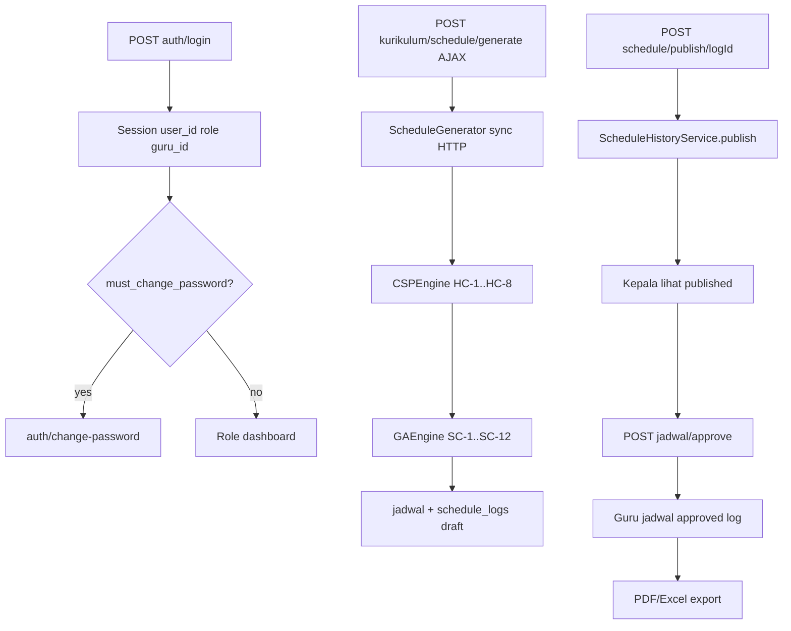

# Audit Fase 1 — System Map: Smart School Scheduling (S3)

> Tanggal: 2026-09-29  
> Mode: **baca-saja** (dokumen ini; tidak mengubah kode aplikasi)  
> Branch: `audit/phase-1-system-map`

---

## 1. Pohon direktori & fungsi modul

### Root

| Path | Fungsi |
|------|--------|
| `app/` | Kode aplikasi CI4 (controllers, models, libraries, views, config, migrations, seeds) |
| `public/` | Document root web (`index.php`, CSS, imgs, uploads) |
| `writable/` | Runtime: cache, session, logs, debugbar (harus writable) |
| `docs/` | PRD, audit prompts, dump SQL referensi |
| `tests/` | PHPUnit (unit/database/session) |
| `vendor/` | Dependensi Composer (**tidak** di-commit; `.gitignore`) |
| `spark` | CLI CI4 |

### `app/` detail

| Path | Fungsi |
|------|--------|
| `Config/` | Routes, Filters, App, Session, Security, Database, dll. |
| `Controllers/` | HTTP: Auth, Profile, Dashboard, Kurikulum/*, Guru/*, KepalaSekolah/* |
| `Models/` | 17 model tabel master + jadwal + schedule_* + app_settings |
| `Libraries/` | CSP/GA, export, branding, manual jadwal, history, provisioning |
| `Filters/` | AuthFilter, KurikulumFilter, GuruFilter, KepalaSekolahFilter |
| `Views/` | Template PHP native per role + layouts + components |
| `Database/Migrations/` | 27 migration skema |
| `Database/Seeds/` | DatabaseSeeder → SmartSchoolSchedulingSeeder (load dump SQL) |
| `Helpers/` | Kosong |
| `Commands/` | Tidak ada custom spark command |
| `Language/` | Hanya placeholder `en/Validation.php` |

### `public/`

| Path | Fungsi |
|------|--------|
| `index.php` | Front controller |
| `css/`, `imgs/` | Aset statis; sidebar masih hardcode `imgs/logo.jpeg` |
| `uploads/branding/` | Logo upload via Pengaturan |
| `.htaccess` | Rewrite ke index.php |

### Tidak ada (gap productization)

- `/install` wizard, `writable/installed.lock`
- Docker / docker-compose
- `.github/workflows` CI
- Modul Installer / Settings registry key-value penuh
- Background job queue untuk generate

---

## 2. Routes (lengkap)

Sumber tunggal: [`app/Config/Routes.php`](../../app/Config/Routes.php).  
`Config\Routing::$autoRoute = false`.

### Global filters

| Layer | Filter | Catatan |
|-------|--------|---------|
| required before | `forcehttps`, `pagecache` | `forceGlobalSecureRequests = false` → HTTPS tidak dipaksa |
| required after | `pagecache`, `performance`, `toolbar` | Toolbar selalu di required |
| globals before | `csrf` kecuali `kurikulum/schedule/generate` | CSRF exempt pada generate |

### Auth & profile

| Method | URL | Controller@method | Filter |
|--------|-----|-------------------|--------|
| GET | `/`, `auth/login` | AuthController::index | public |
| POST | `auth/login` | AuthController::login | public + CSRF |
| POST | `auth/logout` | AuthController::logout | public + CSRF |
| GET/POST | `auth/change-password` | AuthController::changePassword* | auth |
| GET/POST | `profile`, `profile/password` | ProfileController::* | auth |
| redirect | `admin/(:any)` | → `kurikulum/$1` | — |

### Kurikulum (`filter: kurikulum`)

Resources (7 REST each): `users`, `tahun-ajaran`, `jurusan`, `ruangan`, `timeslot`, `guru`, `kelas`, `mapel`.

| Method | URL | Controller@method |
|--------|-----|-------------------|
| GET | `kurikulum/dashboard` | DashboardController::kurikulum |
| POST | `kurikulum/users/(:num)/reset-password` | UserController::resetPassword |
| POST | `kurikulum/guru/import` | GuruController::import |
| GET/POST/DELETE | `kurikulum/guru/(:num)/mapel…` | GuruMapelController |
| GET/POST | `kurikulum/guru/(:num)/hari-blokir` | GuruHariBlokirController |
| GET/POST | `kurikulum/guru/(:num)/preferensi` | GuruPreferensiController |
| GET/POST/DELETE | `kurikulum/kelas/(:num)/mapel…` | KelasMapelController |
| GET/POST | `kurikulum/pengaturan` | PengaturanController |
| GET | `kurikulum/schedule` | ScheduleController::index |
| POST | `kurikulum/schedule/generate` | ScheduleController::generate (**CSRF exempt**) |
| GET/POST | `kurikulum/schedule/config` | ScheduleController::config / saveConfig |
| GET | `kurikulum/schedule/result` | ScheduleController::result |
| GET | `kurikulum/schedule/view/{kelas\|guru\|ruangan}/(:num)` | viewBy* |
| GET | `kurikulum/schedule/export/(:any)` | export |
| POST | `kurikulum/schedule/reset` | reset |
| GET | `kurikulum/schedule/logs` | logs |
| GET | `kurikulum/schedule/history/(:num)` | historyDetail |
| POST | `kurikulum/schedule/publish/(:num)` | publish |
| GET/POST | `kurikulum/schedule/manual/*` | manualOptions/place/delete/swap* |

### Guru (`filter: guru`)

| Method | URL | Controller@method |
|--------|-----|-------------------|
| GET | `guru/dashboard` | Guru\DashboardController::index |
| GET | `guru/jadwal` | Guru\JadwalController::index |
| GET | `guru/jadwal/export/(:segment)` | export |
| GET/POST | `guru/preferensi` | PreferensiController |
| GET/POST | `guru/hari-blokir` | HariBlokirController |

### Kepala Sekolah (`filter: kepala_sekolah`)

| Method | URL | Controller@method |
|--------|-----|-------------------|
| GET | `kepala-sekolah/dashboard` | DashboardController::kepalaSekolah |
| GET | `kepala-sekolah/jadwal` | JadwalController::index |
| POST | `kepala-sekolah/jadwal/approve\|reject` | approve / reject |
| GET | `kepala-sekolah/jadwal/{kelas\|guru\|ruangan}/(:num)` | viewBy* |
| GET | `kepala-sekolah/jadwal/export/(:segment)` | export |
| GET | `kepala-sekolah/laporan/guru-jam` | LaporanController::guruJam |
| GET | `kepala-sekolah/laporan/guru-jam/export` | export |

---

## 3. Inventory kode

### Controllers (24)

- Root: `AuthController`, `ProfileController`, `DashboardController`, `BaseController`
- Kurikulum: User, TahunAjaran, Jurusan, Ruangan, Timeslot, Guru, GuruMapel, GuruHariBlokir, GuruPreferensi, Kelas, KelasMapel, Mapel, Pengaturan, Schedule
- Guru: Dashboard, Jadwal, Preferensi, HariBlokir
- KepalaSekolah: Jadwal, Laporan

### Models (17)

`UserModel`, `GuruModel`, `GuruMapelModel`, `GuruHariBlokirModel`, `GuruPreferensiModel`, `TahunAjaranModel`, `JurusanModel`, `RuanganModel`, `KelasModel`, `KelasMapelModel`, `MapelModel`, `TimeslotModel`, `HariModel`, `JadwalModel`, `ScheduleConfigModel`, `ScheduleLogModel`, `AppSettingModel`

### Libraries (14)

`ScheduleGenerator`, `CSPEngine`, `GAEngine`, `SchedulingContext`, `ScheduleHistoryService`, `HistoryRepairEngine`, `JadwalManualService`, `JadwalPlacementValidator`, `LabAssignment`, `PdfExporter`, `ExcelExporter`, `LaporanGuruJamExporter`, `BrandingService`, `GuruProvisioningService`

### Filters (4)

`AuthFilter`, `KurikulumFilter`, `GuruFilter`, `KepalaSekolahFilter`

### Helpers / Commands

Helpers: kosong. Custom Spark commands: **tidak ada**.

---

## 4. Skema database

### Migrations (27) → tabel aplikasi

`hari`, `tahun_ajaran`, `jurusan`, `users`, `ruangan`, `guru`, `mapel`, `kelas`, `timeslot`, `guru_mapel`, `guru_hari_blokir`, `kelas_mapel`, `jadwal`, `schedule_config`, `schedule_logs`, `guru_preferensi` (via history migration), `app_settings`, plus alter: email login, soft-delete drops, labs, bobot kognitif, approval fields, `users.is_admin`.

### Soft delete

Ada `deleted_at`: `users`, `guru`, `jurusan`, `ruangan`, `mapel`, `kelas`, `tahun_ajaran`.  
Tidak ada: `hari`, `timeslot`, `jadwal`, `schedule_*`, `guru_mapel`, `kelas_mapel`, `guru_hari_blokir`.

**Drift:** `KelasModel::$useSoftDeletes = false` padahal kolom `deleted_at` ada di DB.

### Unique conflict keys `jadwal` (aktual)

`(schedule_log_id, hari_id, timeslot_id, kelas_id|guru_id|ruangan_id)` — tiga unique indexes.

### Dump vs seeder

| Sumber | Status |
|--------|--------|
| `docs/database/smart_school_scheduling.sql` | Dump lengkap ~18 tabel + data SMK Tunas / `@smktunas.sch.id` |
| `SmartSchoolSchedulingSeeder` | Memuat 15 tabel; **omit** `app_settings`, `guru_preferensi` |

### Settings

`app_settings`: kolom `nama_sekolah`, `logo_path` (bukan key-value registry). Default seed migration: `SMK Tunas Teknologi`.

---

## 5. Alur data utama

### Auth session keys

`user_id`, `role`, `nama`, `guru_id`, `is_admin`, `must_change_password`, `logged_in`.  
Password: `password_hash` bcrypt di `UserModel`; verify di `AuthController`.  
Session regenerate pada login.

### Visibility jadwal

- Kurikulum: semua history/draft
- Kepala: published (approve/reject)
- Guru: hanya schedule log **approved** (`JadwalModel::resolveApprovedScheduleLogId`)

---

## 6. Dependensi Composer

| Paket | Constraint | Catatan |
|-------|------------|---------|
| php | ^8.2 | Vendor lokal platform_check sering ≥ 8.3 |
| codeigniter4/framework | ^4.7 | MIT |
| dompdf/dompdf | ^3.1 | LGPL |
| phpoffice/phpspreadsheet | ^5.8 | MIT |
| phpunit/phpunit (dev) | ^10.5.16 | |
| fakerphp/faker, vfsstream (dev) | | |

Root `LICENSE`: MIT (CI4 starter).  
`composer audit` / `outdated`: dijalankan di lingkungan dengan PHP ≥ platform vendor saat Fase 2/6.

---

## 7. Hardcoded nilai spesifik sekolah

| File:line | Nilai | Harus jadi |
|-----------|-------|------------|
| `BrandingService.php:28` | Fallback `SMK Tunas Teknologi` | settings / netral |
| `PengaturanController.php:25` | Insert default Tunas | settings |
| `CreateAppSettingsTable.php:13,22` | Default + seed Tunas | default kosong/netral |
| `UserController.php:30,51,167,171` | `password123` | password acak sekali-pakai |
| `GuruProvisioningService.php:212` | `password123` | sama |
| `GuruController.php:78` | flash password123 | sama |
| Views users/guru index | UI teks password123 | sama |
| `layouts/main.php:32` | `imgs/logo.jpeg` hardcode | logo dari settings |
| `docs/database/*.sql` | `@smktunas.sch.id`, nama sekolah | template opsional legacy |
| `README.md:225-226` | demo credentials | netral / installer |

---

## 8. Titik masuk input user

| Jenis | Lokasi |
|-------|--------|
| Form POST | Login, profile, semua CRUD Kurikulum, preferensi/hari-blokir Guru, approve/reject Kepsek, pengaturan |
| Query string | Export format, filter laporan, view IDs |
| AJAX JSON | `schedule/generate`, manual place/delete/swap |
| Upload file | `guru/import`, logo pengaturan (`uploads/branding/`) |
| Path params | Resource IDs (`(:num)`), export segment |

---

## 9. Temuan awal (untuk Fase 2+)

1. **Tidak ada installer** — setup manual `.env` + migrate + seed dump Tunas.
2. **Generate sinkron** memblokir HTTP; CSRF exempt khusus endpoint itu.
3. **Password default tebakable** di banyak jalur provisioning.
4. **Productization parsial** — `app_settings` + BrandingService ada; sidebar logo & seed masih Tunas.
5. **Tidak ada CI/Docker/i18n UI**.
6. DomPDF `isRemoteEnabled = false` sudah benar; `insertBatch` sudah dipakai di generator.

---

## 10. Cara verifikasi dokumen ini

- Bandingkan route list dengan `app/Config/Routes.php`
- Bandingkan migration list dengan `app/Database/Migrations/`
- `rg -ni "tunas|password123|smktunas" app/`

## Risiko / belum selesai

- `composer audit` belum dijalankan di dokumen ini (butuh lingkungan PHP selaras platform)
- IDOR detail per endpoint belum diverifikasi line-by-line (Fase 2)
- EXPLAIN query belum dijalankan (Fase 3)
